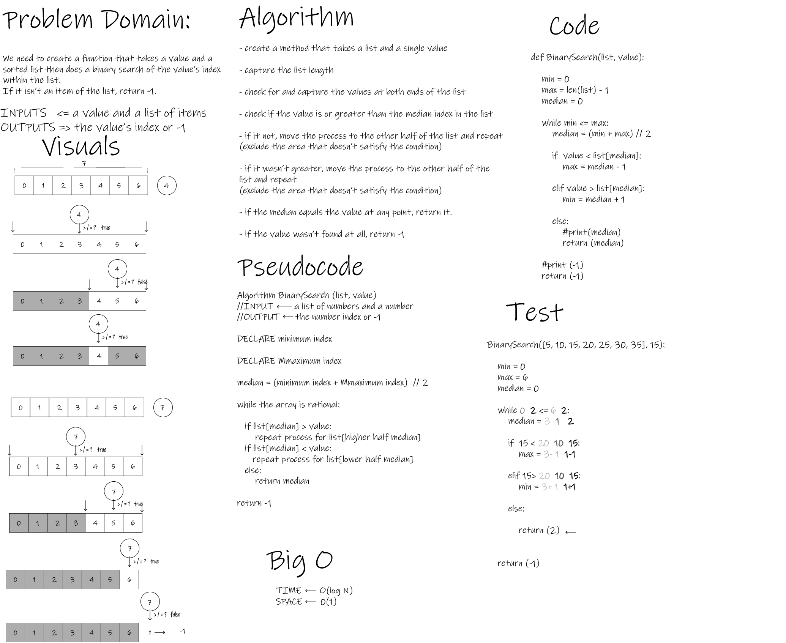

# Binary Search of Sorted Array

- We need to create a function that takes a value and a sorted list then does a binary search of the value’s index within the list.
- If it isn’t an item of the list, return -1.

## Whiteboard Process

## Approach & Efficiency
- I tried to take apart the task and use the given resources and data to tie down the possible logic required to achieve the goal.
- Visualizing the concept gave away the answer when a little bit of logic was applied onto it.
- Time : O(logN) Space: O(1)
