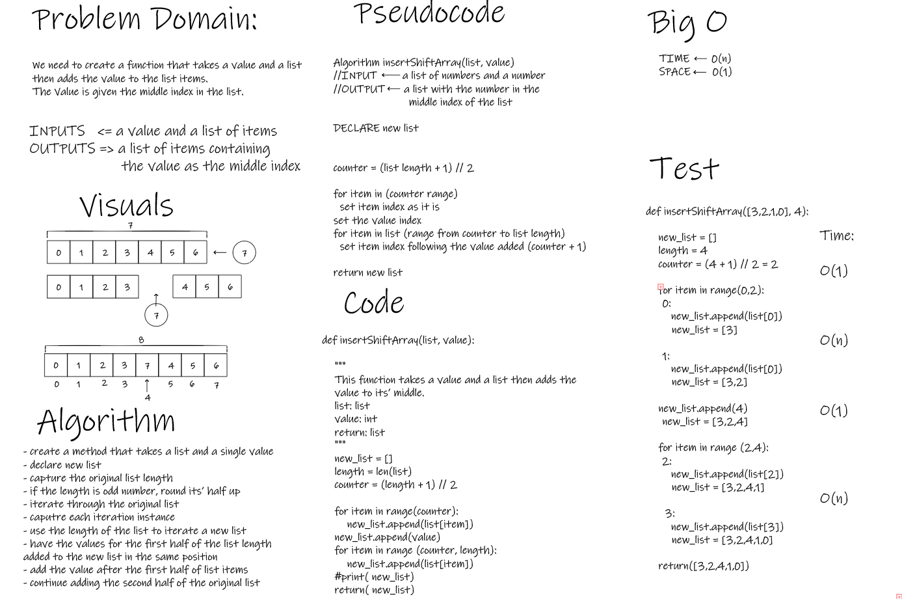

# Insert to Middle of an Array

- We need to create a function that takes a value and a list then adds the value to the list items.
The Value is given the middle index in the list.

## Whiteboard Process

## Approach & Efficiency

- Again, taking the problem apart, then visualizing it revealed the order of steps need to be taken.
- Visual presentation was then converted to written logical steps and into to code.
- Linear time complexity and constant for space.
