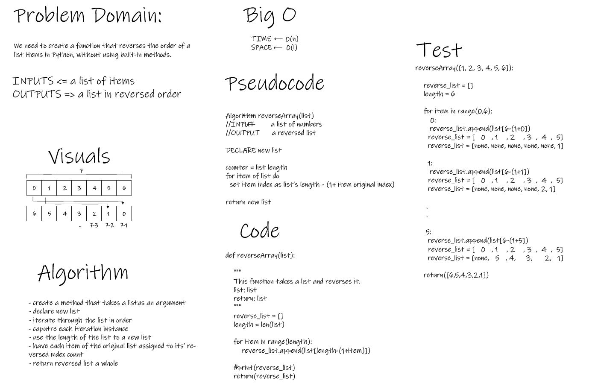

# Reverse an Array
- Write a function called `reverseArray` which takes an array as an argument. Without utilizing any of the built-in methods available to your language, return an array with elements in reversed order.

## Whiteboard Process

## Approach & Efficiency
- I tackled this problem by decomposing the required output, realted it to the input, and made connections in-between using logic then converted it into code.
- I think in this specific case, since the output uses the same input "items", it is necessary to understand what they went through in order to become what they'd become.
- Linear notation for time and constant notation for space (I guess).
