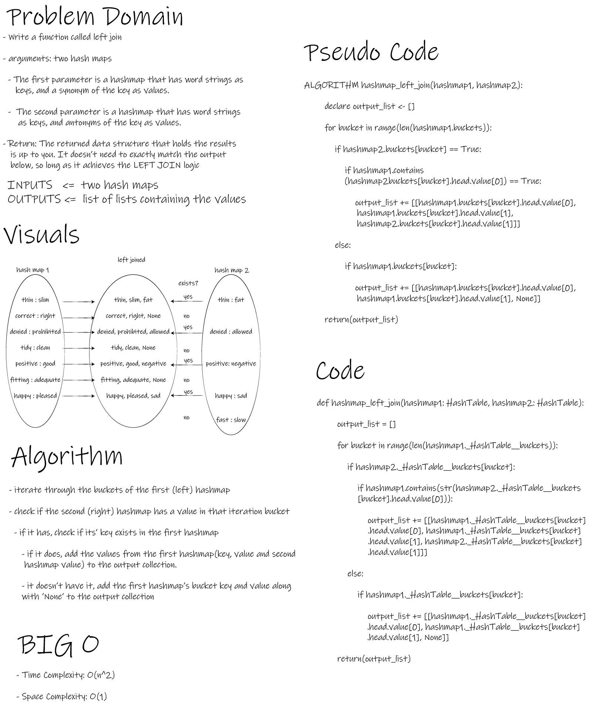

# Hash Table - hashmap-repeated-word - hashmap-left-join

- This Module provides means to create Hash Table Data Structure and modify them to some extent.

 

## Challenge

- To implement new data-structure and manipulate it.

 

## Whiteboard Process

- hashmap-repeated-word

 

- hashmap-left-join

## Approach & Efficiency

- O complexity (Time and Space) for (HashTable.__hash) method is O(1).

- O complexity (Time and Space) for (HashTable.add) method is O(1).

- O complexity (Time) for (HashTable.contains) method is O(n).
- O complexity (Space) for (HashTable.contains) method is O(1).

- O complexity (Time) for (HashTable.get) method is O(n).
- O complexity (Space) for (HashTable.get) method is O(1).

- O complexity (Time) for (hashmap-repeated-word) function is O(n^2).
- O complexity (Space) for (hashmap-repeated-word) function is O(n).

- O complexity (Time) for (hashmap-left-join) function is O(n^2).
- O complexity (Space) for (hashmap-left-join) function is O(1).

 

## API

- HashTree()

        HashTable is a data structue that stores key/value data pairs.

        Arguments:

        size: int, number of buckets in the hash table

- HashTable.__hash()

            A method to convert a string into an index number.

            Arguments:

            key: str

            Return: int, an index number

- HashTable.add()

            add:

            A method to add data pairs to Hash Table.

            Arguments:

            key: str
            value: str

            Return: None

- HashTable.get()

            A method to retrieve data from Hash Table.

            Arguments:

            key: str

            Return: str, the value of the given key.

- HashTable.contains()

            A method to check if the key exists in the hash table.

            Arguments:

            key: str

            Return: Boolean.

- hashmap-repeated-word()

            hashmap_repeated_word is a function that maps a string into a hash table and returns the first repeated word within it.

            Arguments:

            str: str

            Returns: str, the first repeated word

- hashmap-left-join()

            hashmap_left_join returns all data from the first hashmap, even if there are no matches in the right table. If it has matches on the second hashmap, it'll return the values along with the corresponding data from the first hashmap, if not, they'll be replaced by None.

            Arguments:
            hashmap1: HashTable
            hashmap2: HashTable

            Return: List of lists containing the joined values.

 

## Testing Goals

- HashTable

- [x] Adding a key/value to your hashtable results in the value being in the data structure
- [x] Retrieving based on a key returns the value stored
- [x] Successfully returns null for a key that does not exist in the hashtable
- [X] Successfully handle a collision within the hashtable
- [X] Successfully retrieve a value from a bucket within the hashtable that has a collision
- [x] Successfully hash a key to an in-range value

---------------------------------------------------------------------------

- hashmap-repeated-word

- [x] Successfully returns the most repeated word in a string
- [X] Successfully returns an empty string if no words were repeated
- [X] Successfully raises an exception if the string is empty or if there was an input error

---------------------------------------------------------------------------

- hashmap-left-join

- [x] Successfully returns the a collection of the first hashmap data
- [X] Successfully returns values that did not exist in the second hashmap as None
- [X] Successfully raises an exception if an error occurs
