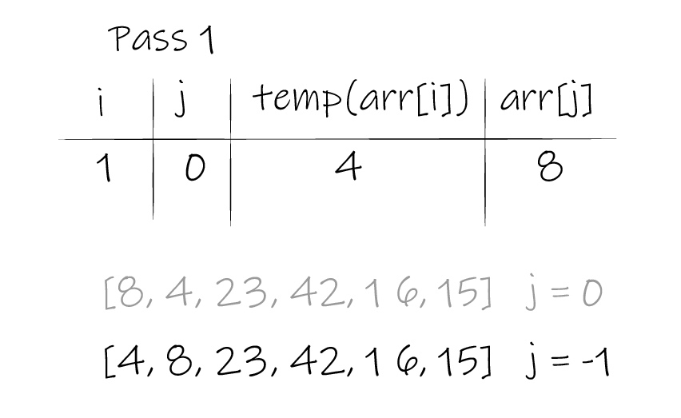
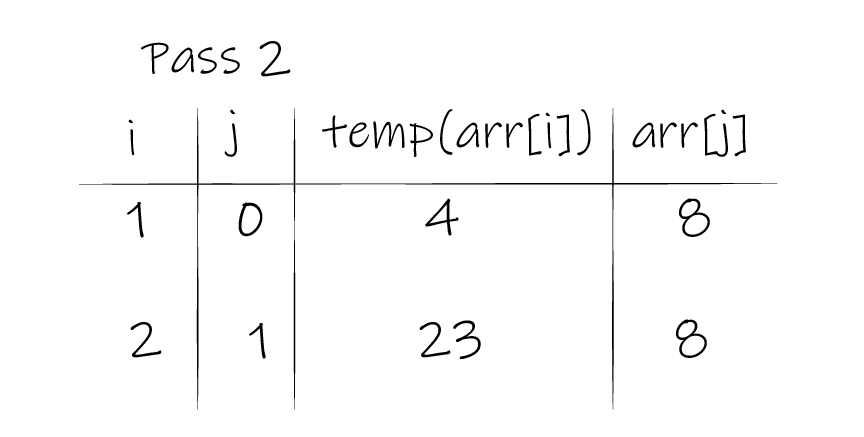
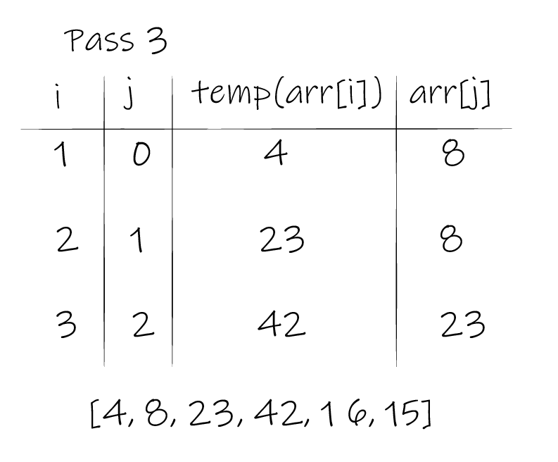
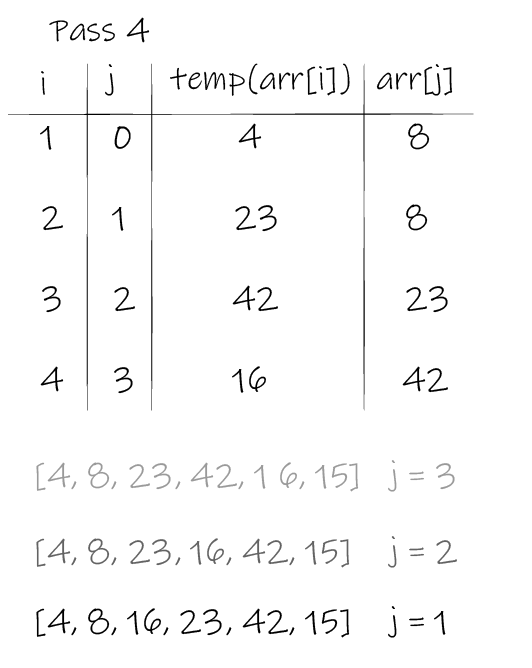
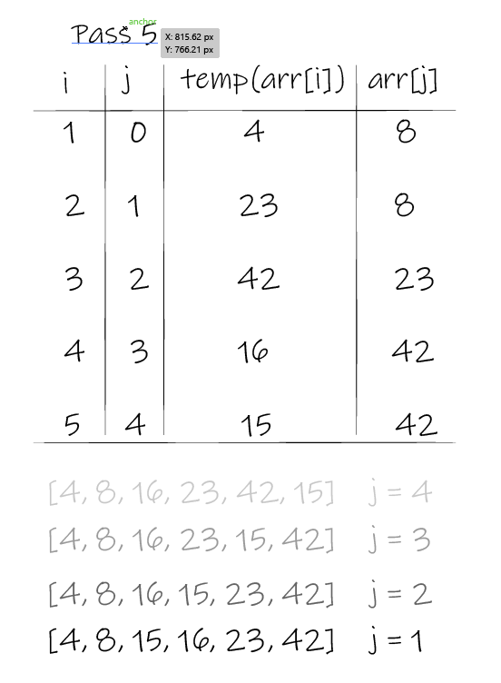

# Insertion Sort

Selection Sort is a sorting algorithm that traverses the array multiple times as it slowly builds out the sorting sequence. The traversal keeps track of the current and pervious values, compares them and re-orders them if needed.

## Pseudocode

```py

SelectionSort(int[] arr)
    DECLARE n <-- arr.Length;
    FOR i = 0; i to n - 1
        DECLARE min <-- i;
        FOR j = i + 1 to n
            if (arr[j] < arr[min])
                min <-- j;

        DECLARE temp <-- arr[min];
        arr[min] <-- arr[i];
        arr[i] <-- temp;

```

## Trace

### Pass1:



### Pass2:



### Pass3:



### Pass4:



### Pass5:



## Efficency

```

Time: O(n^2)
The basic operation of this algorithm is comparison. This will happen n * (n-1) number of times…concluding the algorithm to be n squared.

Space: O(1)
No additional space is being created. This array is being sorted in place…keeping the space at constant O(1).

```
## Code

```py

def InsertionSort(arr):

    for i in range(1, len(arr)):
        j = i-1
        temp = arr[i]

        	while j >=0 and temp <arr[j]:
            	arr[j+1] = arr[j]
            	j = j-1

        	arr[j+1] = temp

    return arr

```

## Testing

```py

def test_insertion_sort():
    #Arrange
    expected = [4, 8, 15, 16, 23, 42]

    #Act
    actual = insertion_sort([8,4,23,42,16,15])

    #Assert
    assert actual == expected

    # [4, 8, 15, 16, 23, 42]

```
