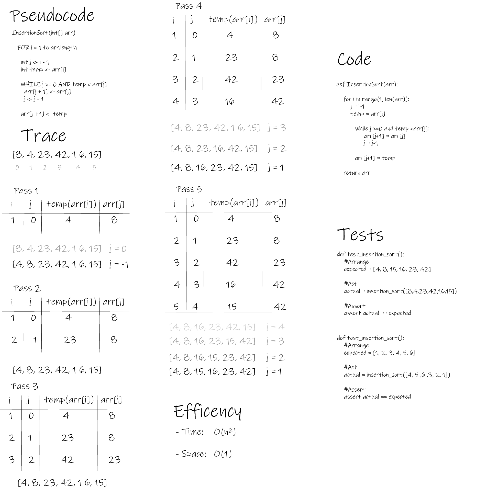

# Challenge Summary

- This module contains Insertion Sort algorithm.

## Whiteboard Process



## Approach & Efficiency

- Big O for Time: O(n^2)

- Big O for Space: O(1)

## Solution

```py

def insertion_sort(arr):
    for i in range(1, len(arr)):
        j = i-1
        temp = arr[i]

        while j >=0 and temp <arr[j]:
            arr[j+1] = arr[j]
            j = j-1

        arr[j+1] = temp

    return arr

```
