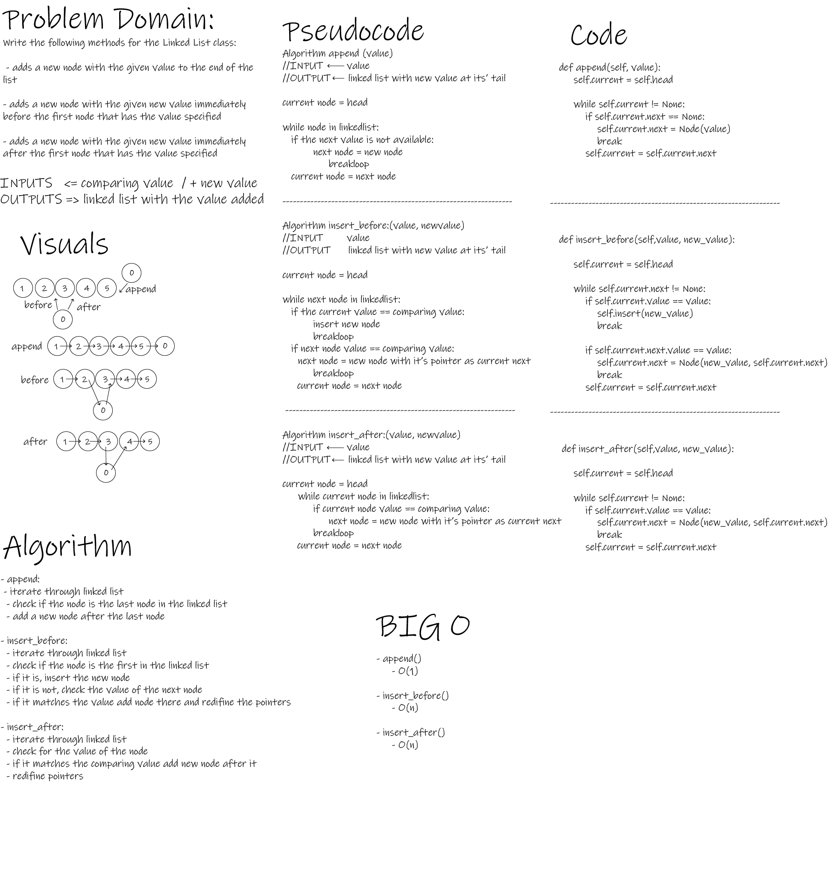

# Singly Linked List - Linked-List-Insertions

- This Module provides means to create Nodes and Linked Lists and modify them to some extent.

 

## Challenge

- To implement new data-sahpe and manipulate it.

 

## Whiteboard Process

 

## Approach & Efficiency

- O time and complexity for (insert) method: O(1)
- O time complexity for (includes and to_string) methods: O(n)
- O time complexity for (append) method: O(n)
- O time complexity for (insert_before and insert_after) methods: O(n)

 

## API

- LinkedList.insert()

        Adds a new node with that value to the head of the list.

        Arguments:
        value: any

        Return: None

- LinkedList.includes()

        Indicates whether that value exists as a Node’s value somewhere within the list.

        Arguments:
        value: any

        Return: Boolean

- LinkedList.to_string()

        Returns a formatted string representing all the values in the Linked List.

        Arguments:
        None

        Return: String Output

- LinkedList.append()
        Adds a new node with the given value to the end of the list

        Arguments:
        value: any

        Return: None

- LinkedList.insert_before()
        Adds a new node with the given new value immediately before the first node that has the value specified.

        Arguments:
        value: any
        new_value: any

        Return: None

- LinkedList.insert_after()
        Adds a new node with the given new value immediately after the first node that has the value specified.

        Arguments:
        value: any
        new_value: any

        Return: None

 

## Testing Goals

- [x] Can successfully instantiate an empty linked list.
- [x] Can properly insert into the linked list.
- [x] The head property will properly point to the first node in the linked list.
- [x] Can properly insert multiple nodes into the linked list.
- [x] Will return true when finding a value within the linked list that exists.
- [x] Will return false when searching for a value in the linked list that does not exist.
- [x] Can properly return a collection of all the values that exist in the linked list.

--------------------------------------------------------------------------------------------

- [x] Can successfully add a node to the end of the linked list
- [x] Can successfully add multiple nodes to the end of a linked list
- [x] Can successfully insert a node before a node located in the middle of a linked list
- [x] Can successfully insert a node before the first node of a linked list
- [x] Can successfully insert after a node in the middle of the linked list
- [x] Can successfully insert a node after the last node of the linked list
