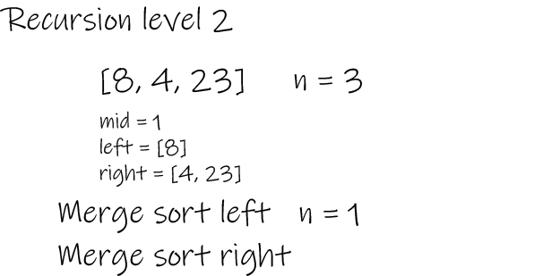
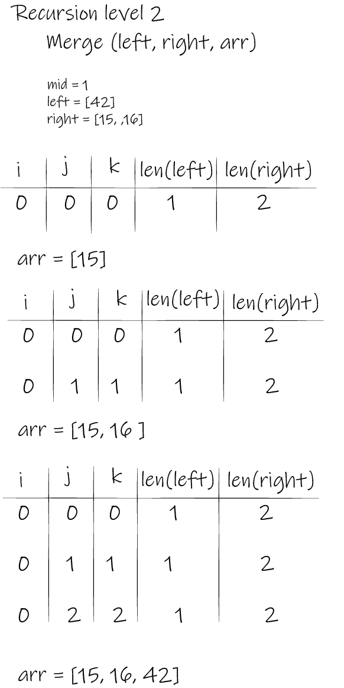

# Merge Sort

Merge Sort is a sorting algorithm that a list and slowly dissects the list into smaller parts. The traversal keeps track of the smaller lists and the main one that they'll be merged back into.

## Pseudocode

```py

ALGORITHM Mergesort(arr)
    DECLARE n <-- arr.length

    if n > 1
      DECLARE mid <-- n/2
      DECLARE left <-- arr[0...mid]
      DECLARE right <-- arr[mid...n]
      // sort the left side
      Mergesort(left)
      // sort the right side
      Mergesort(right)
      // merge the sorted left and right sides together
      Merge(left, right, arr)

ALGORITHM Merge(left, right, arr)
    DECLARE i <-- 0
    DECLARE j <-- 0
    DECLARE k <-- 0

    while i < left.length && j < right.length
        if left[i] <= right[j]
            arr[k] <-- left[i]
            i <-- i + 1
        else
            arr[k] <-- right[j]
            j <-- j + 1

        k <-- k + 1

    if i = left.length
       set remaining entries in arr to remaining values in right
    else
       set remaining entries in arr to remaining values in left

```

## Trace

### Stage 1:


### Stage 2:



### Stage 3:


### Stage 4:


### Stage 5:


### Stage 6:



### Stage 7:


## Efficency

```

Time: O(n logn(n))
As the basic operation of this algorithm is recursion.

Space: O(1)
No additional space is being created. This array is being sorted in place…keeping the space at constant O(1).

```

## Code

```py


def merge(left, right, arr):

    i = 0
    j = 0
    k = 0

    while i <len(left) and j< len(right):
        if left[i] <= right[j]:
            arr[k] = left[i]
            i += 1

        else:
            arr[k] = right[j]
            j += 1

        k += 1

    while i < len(left):
        arr[k] = left[i]
        k += 1
        i += 1

    while j < len(right):
        arr[k] = right[j]
        k += 1
        j += 1


def merge_sort(arr):

    n = len(arr)

    if n >1:
        mid = n//2
        left = arr[:mid]
        right = arr[mid:]

        merge_sort(left)

        merge_sort(right)

        merge(left, right, arr)

    return arr

```

## Testing

```py

def test_merge_sort_sorted():
    #Arrange
    expected = [4, 8, 15, 16, 23, 42]

    #Act
    actual = merge_sort([8,4,23,42,16,15])

    #Assert
    assert actual == expected

    # [4, 8, 15, 16, 23, 42]

```
