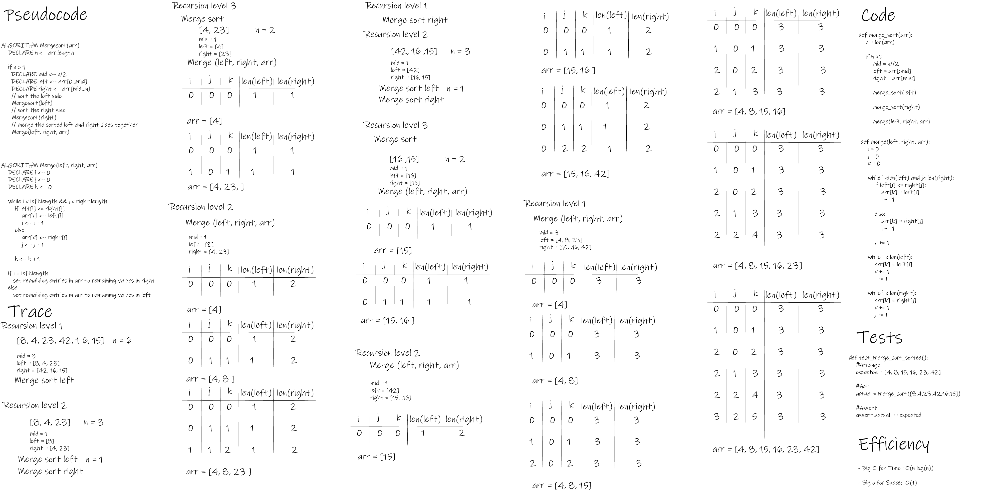

# Challenge Summary

- This module contains Merge Sort algorithm.

## Whiteboard Process



## Approach & Efficiency

- Big O for Time: O(nlog(n))

- Big O for Space: O(1)

## Solution

```py

def merge(left, right, arr):

    i = 0
    j = 0
    k = 0

    while i <len(left) and j< len(right):
        if left[i] <= right[j]:
            arr[k] = left[i]
            i += 1

        else:
            arr[k] = right[j]
            j += 1

        k += 1

    while i < len(left):
        arr[k] = left[i]
        k += 1
        i += 1

    while j < len(right):
        arr[k] = right[j]
        k += 1
        j += 1


def merge_sort(arr):
    n = len(arr)

    if n >1:
        mid = n//2
        left = arr[:mid]
        right = arr[mid:]

        merge_sort(left)

        merge_sort(right)

        merge(left, right, arr)

    return arr

```
