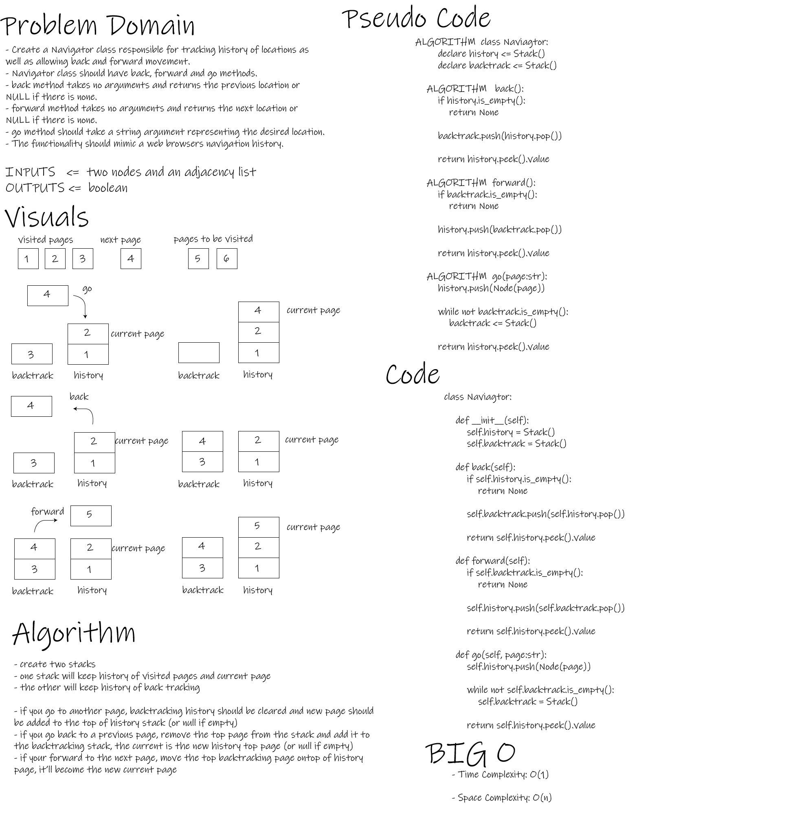

# Navigator

- This Module provides means to create pages history navigator.

 

## Challenge

- To implement new data-sahpe and manipulate it.

 

## Whiteboard Process

- Navigator

 

## Approach & Efficiency

- O Time complexity for (back) method: O(1)
- O Space complexity for (back) method: O(n)

- O Time complexity for (forward) method: O(1)
- O Space complexity for (forward) method: O(n)

- O Time complexity for (go) method: O(1)
- O Space complexity for (go) method: O(n)

 

## API

- Navigator.back()

            back method takes no arguments and returns the previous location or NULL if there is none.

            Arguments: None

            Return: Node value or None

- Navigator.forward()

            forward method takes no arguments and returns the next location or NULL if there is none.

            Arguments: None

            Return: Node value or None

- Navigator.go()

            go method should take a string argument representing the desired location.

            Arguments: Str

            Return: Node value or None

 

## Testing Goals

- Navigator

- [x] Can successfully return None if there are no items in history.
- [x] Can successfully return visited pages.
- [x] Can successfully return re-visited pages.
- [x] Can successfully redirect to a new page.
