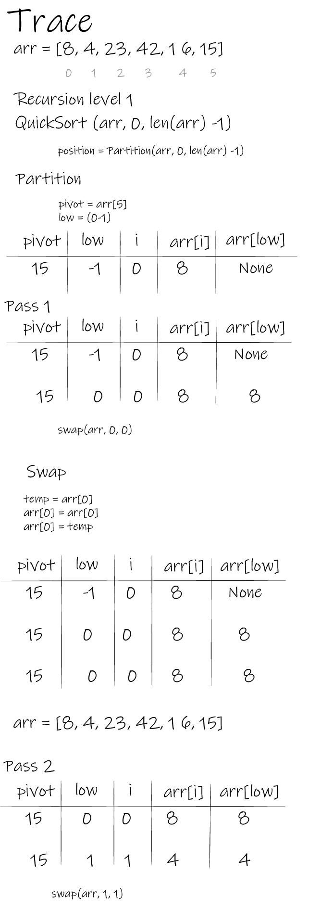
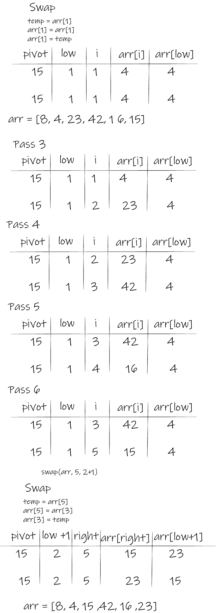
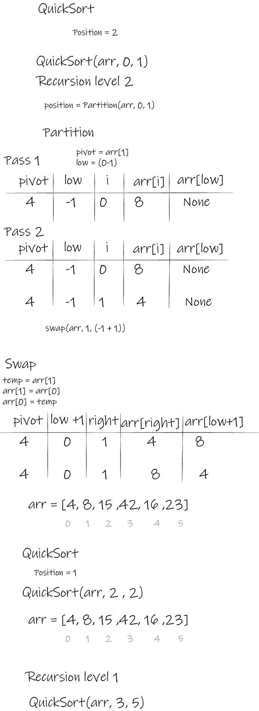
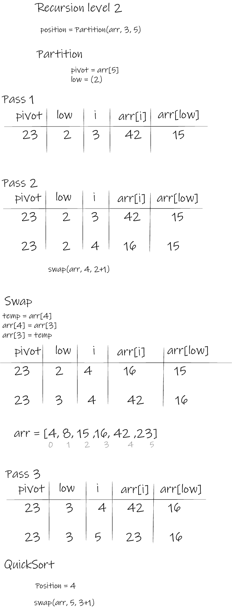
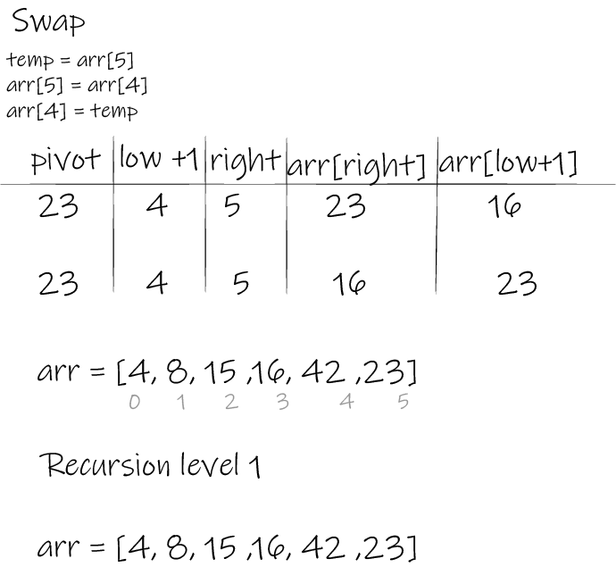

# Quick Sort

Quick Sort is a sorting algorithm that takes a list and slowly partitions it into halves. Then sorts the smallest partitioned halves up to the full length list.

## Pseudocode

```py

ALGORITHM QuickSort(arr, left, right)
    if left < right
        // Partition the array by setting the position of the pivot value
        DEFINE position <-- Partition(arr, left, right)
        // Sort the left
        QuickSort(arr, left, position - 1)
        // Sort the right
        QuickSort(arr, position + 1, right)

ALGORITHM Partition(arr, left, right)
    // set a pivot value as a point of reference
    DEFINE pivot <-- arr[right]
    // create a variable to track the largest index of numbers lower than the defined pivot
    DEFINE low <-- left - 1
    for i <- left to right do
        if arr[i] <= pivot
            low++
            Swap(arr, i, low)

     // place the value of the pivot location in the middle.
     // all numbers smaller than the pivot are on the left, larger on the right.
     Swap(arr, right, low + 1)
    // return the pivot index point
     return low + 1

ALGORITHM Swap(arr, i, low)
    DEFINE temp;
    temp <-- arr[i]
    arr[i] <-- arr[low]
    arr[low] <-- temp

```

## Trace

### Stage 1:



### Stage 2:



### Stage 3:



### Stage 4:



### Stage 5:



## Efficency

```

Time: O(n^2)
As the basic operation of this looping over list halves recursively.

Space: O(1)
No additional space is being created. This array is being sorted in place…keeping the space at constant O(1).

```

## Code

```py


def quick_sort(arr, left, right):
    if left < right:
        position = partition(arr, left, right)
        quick_sort(arr, left, position-1)
        quick_sort(arr, position+1, right)
    return arr


def partition(arr, left, right):
    pivot = arr[right]
    low = left -1

    for i in range(left, right):
        if arr[i] <= pivot:
            low += 1
            swap(arr, i, low)

    swap(arr, right, low+1)
    return low +1


def swap(arr, i, low):
    temp = arr[i]
    arr[i] = arr[low]
    arr[low] = temp

```

## Testing

```py

def test_quick_sort_sorted():
    #Arrange
    expected = [4, 8, 15, 16, 23, 42]

    #Act
    actual = quick_sort([8,4,23,42,16,15], 0, len([8,4,23,42,16,15])-1)

    #Assert
    assert actual == expected

    # [4, 8, 15, 16, 23, 42]

```
