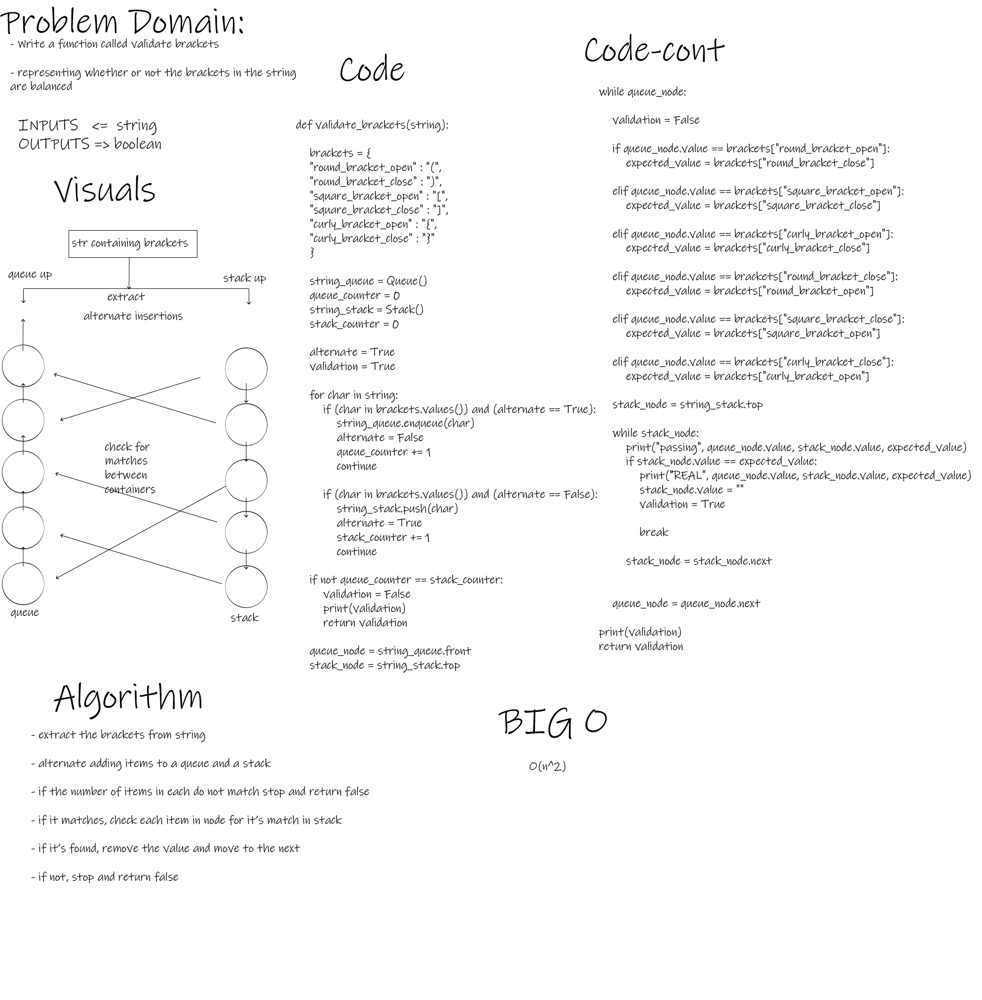

# Stack and Queue - stack-queue-pseudo - stack-queue-animal-shelter - stack-queue-brackets

- This Module provides means to create Stacks and Queues and modify them to some extent.

 

## Challenge

- To implement new data-sahpe and manipulate it.

 

## Whiteboard Process

- stack-queue-pseudo

 

- stack-queue-animal-shelter

 

- stack_queue_brackets

 

## Approach & Efficiency

- O complexity for (Stack.push) method: O(1)
- O complexity for (Stack.pop) method: O(1)
- O complexity for (Stack.peek) method: O(1)
- O complexity for (Stack.is_empty) method: O(1)

- O complexity for (Queue.queue) method: O(1)
- O complexity for (Queue.dequeue) method: O(1)
- O complexity for (Queue.peek) method: O(1)
- O complexity for (Queue.is_empty) method: O(1)

- O complexity for (PseudoQueue.queue) method: O(n)
- O complexity for (PseudoQueue.dequeue) method: O(n)

- O complexity for (AnimalShelter.queue) method: O(1)
- O complexity for (AnimalShelter.dequeue) method: O(n)

- O complexity for (validate_brackets) function: O(n^2)

 

## API

- Stack.push()

        This method adds a Node to the top of a Stack.

        Arguments:
        value: any

- Stack.pop()

        This method removes the top Node of a Stack.

        Arguments: None

        Return: Popped Node Value

- Stack.peek()

        This method returns the value of top Node of a Stack.

        Arguments: None

        Return : Top Node Value

- Stack.is_empty()

        This method checks if a Stack has any Nodes within.

        Arguments: None

        Return : Boolean

- Queue.enqueue()

        This method adds a Node to the back of a Queue.

        Arguments:
        value: any

- Queue.dequeue()

        This method removes a Node to the front of a Queue.

        Arguments: None

        Return: Value of Dequeued Node

- Queue.peek()

        This method returns the value of front Node of a Queue.

        Arguments: None

        Return : Front Node Value

- Queue.is_empty()

        This method checks if a Queue has any Nodes within.

        Arguments: None

        Return : Boolean

- PseudoQueue.queue()

     Queue class creates a Pseudo Queue instances.

     Arguments:
     front: Node
     back: Node

- PseudoQueue.dequeue()

        This method Inserts value into the PseudoQueue, using a first-in, first-out approach..

        Arguments:
        value: any

- AnimalShelter.queue()

        This method adds a Cat/Dog object to the AnimalShelter queue.

        Arguments:
        animal: Cat or Dog object

- AnimalShelter.dequeue()

        This method removes a Cat/Dog object to the AnimalShelter queue.

        Arguments:
        pref : Cat or Dog object

        Return: Dequeued object / None

- validate_brackets()

    Representing whether or not the brackets in the string are balanced.

    Round Brackets : ()
    Square Brackets : []
    Curly Brackets : {}

    Arguments:
    string: string

    Return: boolean

 

## Testing Goals

- Stack and Queue

- [x] Can successfully push onto a stack
- [x] Can successfully push multiple values onto a stack
- [x] Can successfully pop off the stack
- [x] Can successfully empty a stack after multiple pops
- [x] Can successfully peek the next item on the stack
- [x] Can successfully instantiate an empty stack
- [x] Calling pop or peek on empty stack raises exception
- [x] Can successfully enqueue into a queue
- [x] Can successfully enqueue multiple values into a queue
- [x] Can successfully dequeue out of a queue the expected value
- [x] Can successfully peek into a queue, seeing the expected value
- [x] Can successfully empty a queue after multiple dequeues
- [x] Can successfully instantiate an empty queue
- [x] Calling dequeue or peek on empty queue raises exception

---------------------------------------------------------------------------

- stack-queue-pseudo

- [x] Can successfully enqueue into a pseudo_queue
- [x] Can successfully enqueue multiple values into a pseudo_queue
- [x] Can successfully dequeue out of a pseudo_queue the expected value
- [x] Can successfully empty a pseudo_queue after multiple dequeues
- [x] Can successfully instantiate an empty pseudo_queue

---------------------------------------------------------------------------

- stack-queue-animal-shelter

- [x] Can successfully enqueue into a shelter
- [x] Can successfully enqueue multiple values into a shelter
- [x] Can successfully dequeue out of a shelter the expected value
- [x] Can successfully dequeue out of a shelter the multiple expected values
- [x] Can successfully empty a shelter after multiple dequeues
- [x] Can successfully instantiate an empty shelter
- [x] Can successfully detect invalid inputs

---------------------------------------------------------------------------

- validate_brackets

- [x] Can successfully detect unbalanced brackets
- [x] Can successfully detect balanced brackets
- [x] Can successfully detect programmatically unbalanced brackets
