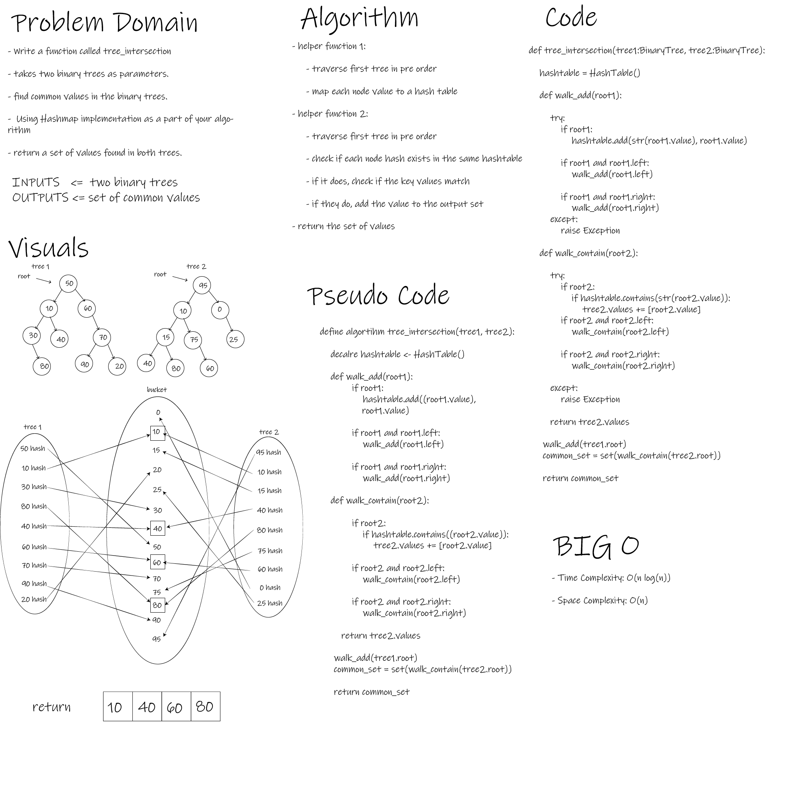

# Tree Intersection

- This Module provides a function that returns the common values between two binary trees.

 

## Challenge

- To implement new data-structure and manipulate it.

 

## Whiteboard Process

- hashmap-repeated-word

## Approach & Efficiency

- O complexity (Time) for (tree_intersection) function is O(nlog(n)).
- O complexity (Space) for (tree_intersection) function is O(n).

 

## API

- tree_intersection

            tree_intersection function finds common values in 2 binary trees.

            Arguments:

            tree1: BinaryTree

            tree2: BinaryTree

            Return: Set containing common values

- walk_add

            walk_add is a helper method for tree_intersection.

            Arguments:

            root: Tree Root Node

- walk_contain

            walk_contain is a helper function for tree_intersection.

            Arguments:

            root: Tree Root Node

            Return: List of Values

 

## Testing Goals

- tree_intersection

- [X] Successfully returns the common values between two binary trees
- [X] Successfully returns an empty set if no values match
- [X] Successfully handles node values other than numbers
- [X] Successfully raises exceptions when an error occurs
