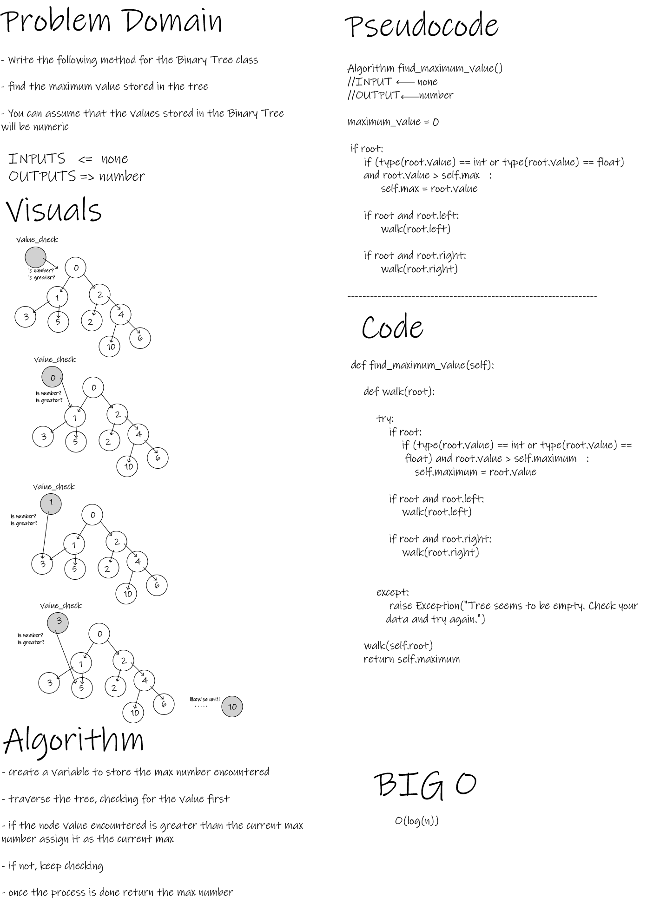

# Binary Tree and BST Implementation - tree-max - tree-breadth-first

- This Module provides means to create Trees Data Structure and modify them to some extent.

 

## Challenge

- To implement new data-sahpe and manipulate it.

 

## Whiteboard Process

- tree-max

 

- tree-breadth-first

 

## Approach & Efficiency

- O complexity for (BinaryTree.pre_order) method: O(log(n))
- O complexity for (BinaryTree.in_order) method: O(log(n))
- O complexity for (BinaryTree.post_order) method: O(log(n))

- O complexity for (BinarySearchTree.search) method: O(log(n))
- O complexity for (BinarySearchTree.add) method: O(log(n))
- O complexity for (BinarySearchTree.contain) method: O(log(n))

- O complexity for (BinaryTree.find_maximum_value) method: O(log(n))

- O complexity for (breadth_first) function: O(log(n))

 

## API

- BinaryTree.pre_order()

        pre_order method traverses the binary tree in (root >> left >> right) order.

        Arguments: None

        Return: List of Node Values

- BinaryTree.in_order()

        in_order method traverses the binary tree in  (left >> root >> right) order.

        Arguments: None

        Return: List of Node Values

- BinaryTree.post_order()

        post_order method traverses the binary tree in  (left >> right >> root) order.

        Arguments: None

        Return: List of Node Values

- BinarySearchTree.search()

        Searches for a Node lcoation in a Binary Search Tree.

        Arguments:
        value: any

        Return : Target Node

- BinarySearchTree.add()

        Adds a new node with that value in the correct location in the binary search tree.

        Arguments:
        value: any

        Return :Added Node Value

- BinarySearchTree.contain()

        Indicates whether or not a value is in the tree at least once.

        Arguments:
        value: any

        Return :Boolean

- BinaryTree.find_maximum_value()

        find_maximum_value method traverses the binary tree in search for the maximum number its' nodes contain.

        Arguments: None

        Return: Number

- breadth_first()

    Traverse the input tree using a Breadth-first approach.

    Arguments:
    tree: BinaryTree

    Return:  Ordered list of all values in the tree.

 

## Testing Goals

- Binary Tree

- [x] Can successfully instantiate an empty tree
- [x] Can successfully instantiate a tree with a single root node
- [x] Can successfully add a left child and right child to a single root node
- [x] Can successfully return a collection from a preorder traversal
- [x] Can successfully return a collection from an inorder traversal
- [x] Can successfully return a collection from a postorder traversal
- [x] Can successfully raise exceptions

---------------------------------------------------------------------------

- Binary Search Tree

- [x] Can successfully add a value to and empty tree
- [x] Can successfully add a value in its' correct location
- [x] Can successfully detect if a value is in a tree or not
- [x] Can successfully detect added values in tree

---------------------------------------------------------------------------

- Find Maximum Value

- [x] Can successfully find and return the max value
- [x] Can successfully raise exception if tree was empty
- [x] Can successfully check for values when other data types exist

---------------------------------------------------------------------------

- Tree Breadth First

- [x] Can successfully return a collection from a Breadth First traversal
- [x] Can successfully return values in expected order
- [x] Can successfully raise exceptions
